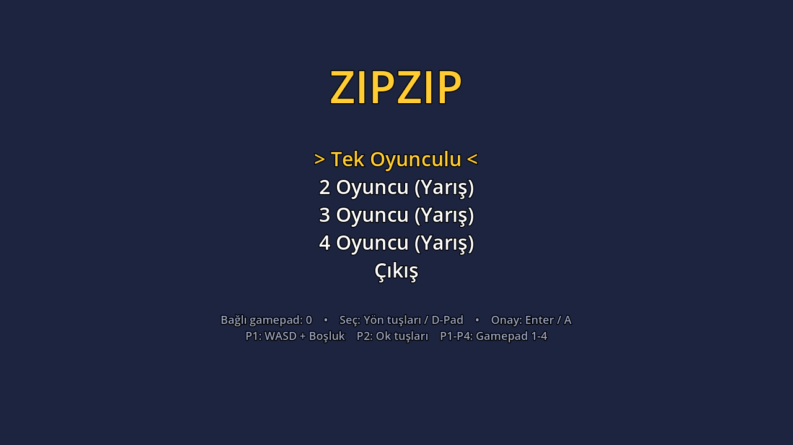
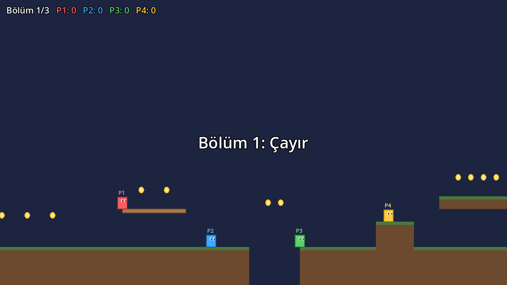

# Zıpzıp

Basit bir 2D platform oyunu. **Tek oyunculu** mod ve **2-4 kişilik yerel (aynı ekran) yarış** modu var.
Godot 4 ile yazıldı. Hiç görsel veya ses dosyası kullanmıyor; her şey kodla çiziliyor. Bu sayede maliyeti sıfır ve ileride kolayca değiştirilebilir.




## Oyun modları

| Mod | Amaç |
|---|---|
| Tek oyunculu | Altınları topla ve bayrağa en kısa sürede ulaş. Süre, altın ve ölüm sayısı tutuluyor. |
| 2-4 oyuncu yarış | Bayrağa ilk varan bölümü kazanır. 3 bölümün sonunda en çok bölüm kazanan oyunu alır. |

Oyunda dikenler, çukurlar, içinden zıplanabilen platformlar ve kontrol noktaları (yeşil bayraklar) var. Oyuncular birbirinin üstüne basabiliyor. Çok geride kalan oyuncu otomatik olarak lidere ışınlanıyor.

## Kontroller

| | Hareket | Zıplama |
|---|---|---|
| P1 klavye | A / D | W / Boşluk |
| P2 klavye | ← / → | ↑ |
| P1-P4 gamepad (Xbox kontrolcüsü) | Sol analog / D-Pad | A |

Duraklatmak için Esc veya Start, ana menüye dönmek için (duraklatılmışken) Q, Back veya B.

## Çalıştırma

1. [Godot 4.3+](https://godotengine.org/download) indir (ücretsiz, kurulum gerektirmiyor).
2. Godot'u aç, **Import** ile bu klasördeki `project.godot` dosyasını seç.
3. F5 ile oyunu başlat.

Testleri çalıştırmak için:

```sh
godot --headless --script res://tests/smoke_test.gd
```

## Yeni bölüm eklemek

Bölümler `scripts/levels.gd` dosyasında ASCII harita olarak duruyor. Yeni bir bölüm için listeye bir harita eklemek yeterli:

```
#  zemin            =  tek yönlü platform
C  altın            ^  diken
S  başlangıç        K  kontrol noktası
F  bitiş bayrağı    .  boşluk
```

Zıplama yaklaşık 3 kare yükseğe çıkıyor. Basamakları en fazla 2 kare yüksek tutarsan bölüm rahat oynanır.

## Xbox'a çıkış yolu

1. **PC'de bitir:** Windows/Steam/itch.io için Godot'tan *Export* ile çıktı al. Bu ücretsiz.
2. **ID@Xbox:** Oynanabilir bir demo hazır olunca [ID@Xbox](https://www.xbox.com/en-US/developers/id) programına başvur. Kabul edilirsen dev kit ve Xbox GDK erişimi veriliyor.
3. **Godot → Xbox:** Godot'un resmi konsol çıktısı yok. Konsol portu için W4 Games gibi üçüncü taraf hizmetler kullanılıyor. Kod değişmeden taşınabiliyor.

## Ucuz oyun geliştirme notları

- **Motor:** Godot ücretsiz ve lisans ücreti yok.
- **Görseller:** Şu an her şey kodla çiziliyor. Daha sonra [Kenney.nl](https://kenney.nl) gibi ücretsiz (CC0) paketler eklenebilir.
- **Ses:** Ücretsiz efektler için sfxr/jsfxr kullanılabilir.
- **Kapsam:** Az mekanik ve çok bölüm. Yeni bölüm eklemek tek bir ASCII harita yazmak kadar ucuz.
